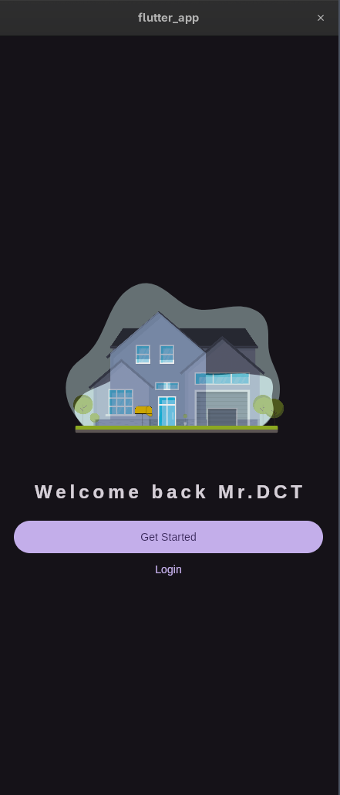
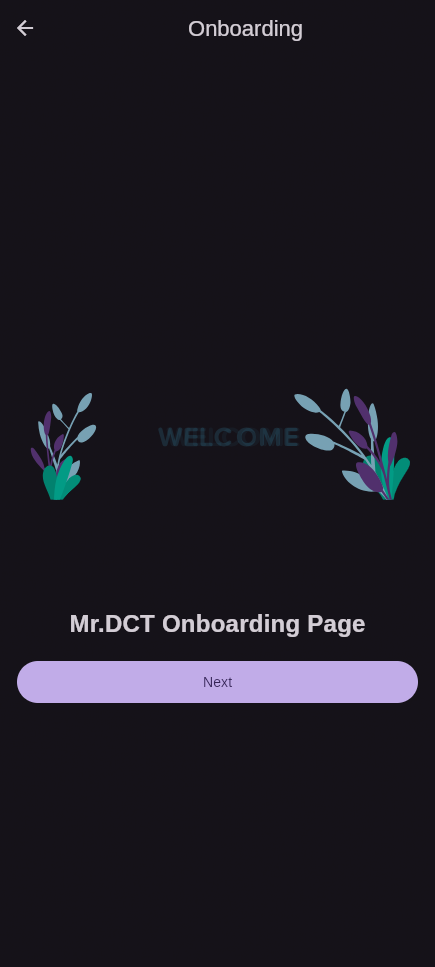
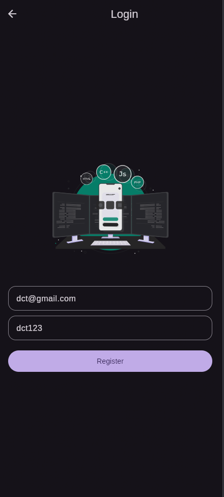
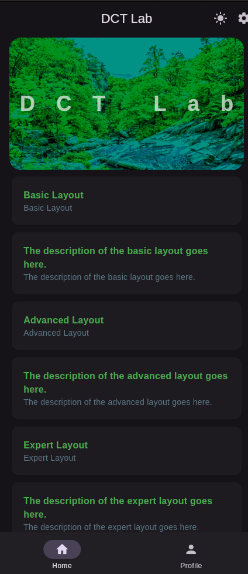
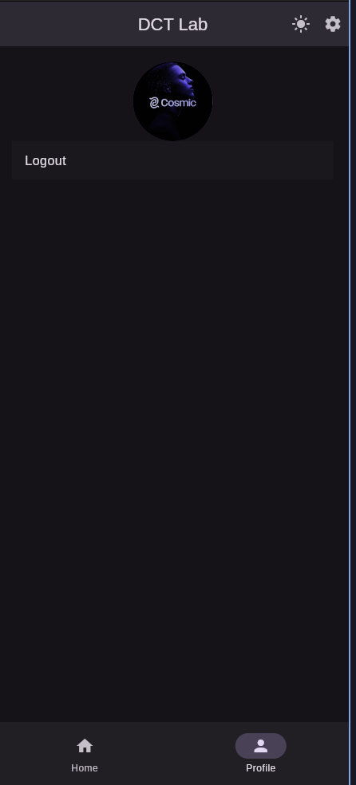
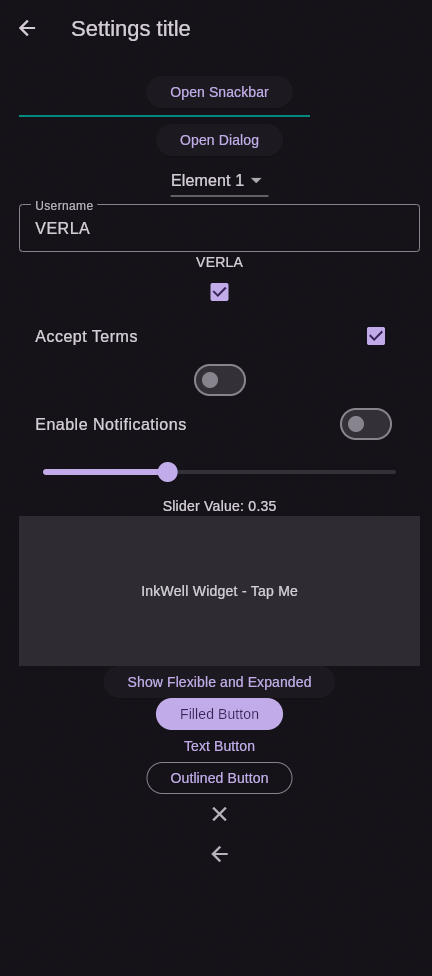
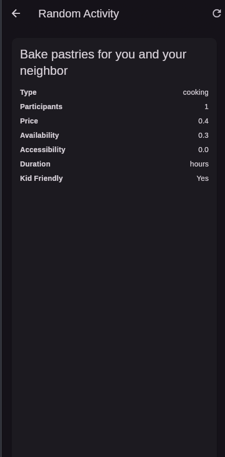

# Flutter Learning Journey

A comprehensive journey on learning Mobile App Development for Android and iOS using Flutter.

## 📱 Screenshots Preview

<div align="center">
  
  
  
</div>

<div align="center">
  
  
  
</div>

<div align="center">
  
</div>

## 🚀 Features

- ✅ Responsive UI for both Android and iOS
- ✅ Light/Dark theme toggle with persistent settings
- ✅ Modern navigation with bottom navigation bar
- ✅ Lottie animations for enhanced user experience
- ✅ Local storage using Shared Preferences
- ✅ Clean architecture with organized components

## 🛠️ Technologies Used

- **Flutter SDK**: Cross-platform mobile development
- **Dart**: Programming language
- **Lottie**: Animated assets
- **Shared Preferences**: Local data persistence
- **HTTP**: Network requests

## 📋 Getting Started

### Prerequisites

- Flutter SDK installed
- Dart SDK installed
- Android Studio/Xcode for device simulators

### Installation

1. Clone the repository:
   ```bash
   git clone <repository-url>
   ```

2. Navigate to project directory:
   ```bash
   cd flutter_app
   ```

3. Install dependencies:
   ```bash
   flutter pub get
   ```

4. Run the application:
   ```bash
   flutter run
   ```

### Building for Production

```bash
flutter build apk      # Android APK
flutter build ios      # iOS IPA
flutter build web      # Web application
```

## 🏗️ Project Structure

```
lib/
├── data/
│   ├── constants.dart     # Constant values and text styles
│   └── notifiers.dart     # ValueNotifiers for state management
├── views/
│   ├── pages/             # Individual page widgets
│   └── widget_tree.dart   # Main app structure
├── widgets/               # Reusable custom widgets
└── main.dart              # Application entry point
```

## 🎨 Key Concepts Demonstrated

- State management using ValueNotifier
- Theme switching with persistent storage
- Navigation patterns
- Custom UI components
- Asset management
- Responsive layouts

## 🤝 Contributing

Contributions are welcome! Feel free to submit a Pull Request.

## 📄 License

This project is open source and available under the [MIT License](LICENSE).

## 📚 Resources

- [Flutter Documentation](https://docs.flutter.dev/)
- [Dart Language Tour](https://dart.dev/language)
- [Flutter Widget Catalog](https://docs.flutter.dev/ui/widgets)
